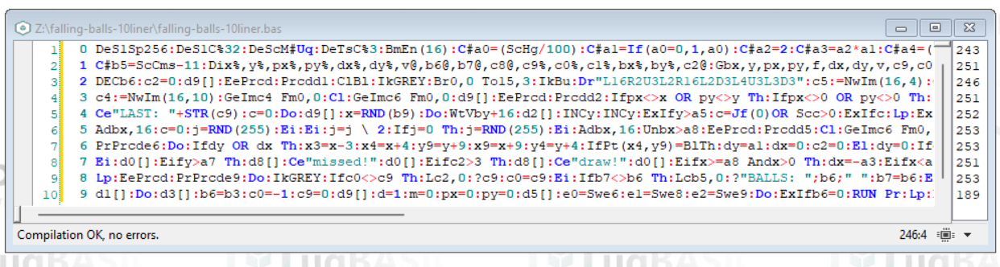

# FALLING BALLS (10 LINER)
BASIC 10 liner "falling balls"

**FALLING BALLS (10 LINER)** is a game written in [ugBASIC](https://ugbasic.iwashere.eu) and that runs on various 8-bit home computers. This game is a arcade game for one player. The aim of the game is to get the ball into the basket at the bottom of the screen in the shortest possible path. The longer the ball travels across the screen, the fewer points you accumulate. It is a self-competiting game. This game is designed for one player.

[Click here](/docs/instructions.md) to read the instructions on how to play. 

[Click here](https://spotlessmind1975.itch.io/falling-balls-10liner) to download the executables for the various home computers:
  * **ATARI 400/800** [XEX or ATR format] ([more info](docs/instructions-atari.md))
  * **ATARI XL/XE** [XEX or ATR format] ([more info](docs/instructions-atarixl.md))
  * **TRS-80 COLOR COMPUTER 1 AND 2** [DSK format] ([more info](docs/instructions-coco.md))
  * **AMSTRAD CPC 664** [DSK format] ([more info](docs/instructions-cpc.md))
  * **OLIVETTI PRODEST PC128** [K7 format] ([more info](docs/instructions-pc128op.md))
  
This game joined the ["BASIC10Liner" competition 2024](https://gkanold.wixsite.com/homeputerium).

Since it joined this competition, the game itself is modest in size, and the given source code respects strong constraints on the length of each line (category: **EXTREME-256**) and it does not rely on third party libraries. The check has been done using [UGBASIC-IDE](https://spotlessmind1975.itch.io/ugbasic-ide).

For those wishing to deepen the details of its implementation, please refer to the commented [source code](/docs/source.md).