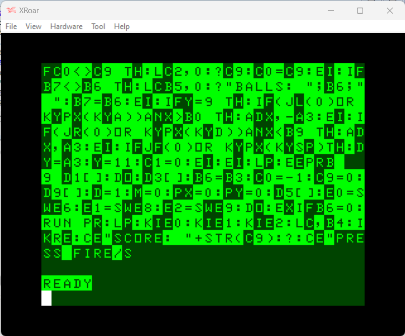
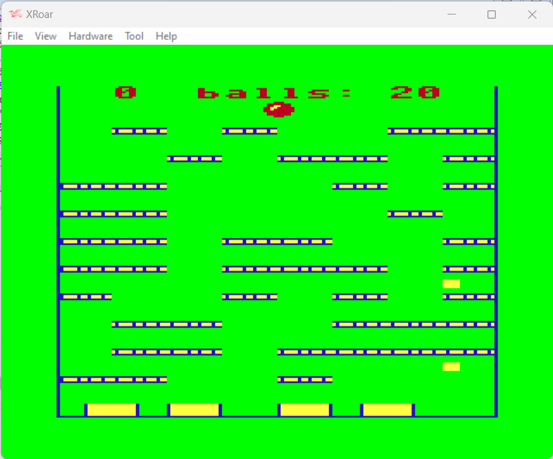

# INSTRUCTIONS

## TRS-80 COLOR COMPUTER 1 and 2

In order to play this game on an **TRS-80 COLOR COMPUTER 1** or **TRS-80 COLOR COMPUTER 2** you need this home computer or to download and install an emulator. The game has been tried on *XRoar version 1.5.3* .

XRoar emulates the Dragon 32/64; Tandy Colour Computers 1, 2 and 3; the Tandy MC-10; and some other similar machines or clones. It runs on a wide variety of platforms.

The emulator can be downloaded [here](https://www.6809.org.uk/xroar/).

### Loading instructions

Once the emulator software has been installed, follow the instructions below:
 - start **xroar.exe** program with the following options on command line: 
 <code>xroar.exe --machine "coco" falling-balls-10liner.coco.dsk</code>;
 - type <code>RUN"LOADER.BAS</code>.
 
### Listing the source code

To take part to the BASIC 10Liner Contest, you must be able to consult the source. This is possible thanks to the [ugBASIC](https://ugbasic.iwashere.eu) runtime module, which allows you to show the source with the `LIST` command.

### Running the game

The game can be run by calling the command `RUN`.
