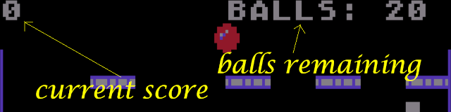
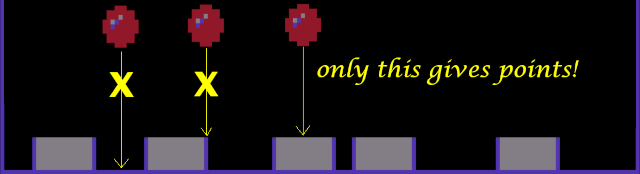

# INSTRUCTIONS

## How to play

In order to play this game you need an original's 8-bit home computer or an emulator, because the game does not work on modern computers. The game has been tried and it works correctly with following computers and emulators:

  * **ATARI 400/800** ([more info](instructions-atari.md))
  * **ATARI XL/XE** ([more info](instructions-atarixl.md))
  * **AMSTRAD CPC 664** ([more info](instructions-cpc.md))
  * **TRS-80 COLOR COMPUTER 1 AND 2** ([more info](docs/instructions-coco.md))
  * **OLIVETTI PRODEST PC128** ([more info](docs/instructions-pc128op.md))

Once loaded, you can run the game by typing `RUN`.

## The aim

The aim of the game is to score as many points as possible with the given set of 20 balls. The score you have collected so far is shown on the left of the screen, while the remaining balls count is shown on the right. When the balls' count arrives to zero, the game is over.

## How to move the ball

In the game you can only move the ball as long as it is at the top of the board. By moving the joystick to the left (or pressing "A") you can move the ball to the left. Moving the joystick to the right (or pressing "D") will allow you to move the ball to the right. To lower the ball from the required position, simply press the FIRE button (or a button). Once started, the ball will drop on its own, following the possibilities given by the obstacles. You cannot alter the movement of the ball, once it has been dropped.

Every time the ball finds an empty space, it drops downwards. Every time it touches a horizontal barrier, the ball randomly decides to move left or right. The probability is equal in both directions. If the ball reaches the edge on the left or right, it reverses its direction. The same happens if it encounters an obstacle.

## How to increase score

To increase the score it is necessary to drop the ball inside the basketball, i.e. in the internal part. Only in this way you can collect points. If the ball falls out of the container, or onto the edge, no points are awarded and the basket is missed.

The amount of points depends on how long the ball travels: the longer the path, the fewer points you can accumulate. In the image above we see that the yellow path will get a greater number of points than the green path.